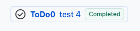

# id-assertion-authz-node-example

This repo is proof-of-concept example of the proposed [Identity Assertion Authorization Grant](https://datatracker.ietf.org/doc/html/draft-parecki-oauth-identity-assertion-authz-grant) flow. This flow is a subset of the Token Exchange grant which allows identity assertions received by a client via SSO to be exchanged with a trusted Identity Provider for an id-jag token. Such a token can then be exchanged for an access token with the resource authorization server. For for information, watch the explainer video [here](https://www.youtube.com/watch?v=I0vdmg79Ga4).


# How To

To demonstrate the usage of this flow, this repo currently contains two applications: **Wiki0** and **Todo0**.

When links to Todo0 tasks are pasted into a Wiki0 page, will unfurl and show task details automatically.
<br />

> [!NOTE]
> When running locally, you must use a domain stored in the local database.
> You should use the email `bob@tables.fake` to login to both applications, and this will initiate the login flow using the IDP information configured.

Steps:

- Login to Todo0
- Create a task in Todo0
- Copy the link to the task by clicking the "#"
  <br />
- Login to Wiki0
- Create a new page
- Edit the page by pasting in the link to the Todo0 task
- See the unfurled task populate! (Example below)



# Dev Setup

This application runs locally using [VSCode Dev Containers](https://code.visualstudio.com/docs/devcontainers/tutorial). If you cannot use VSCode, you can follow the instructions [here](#non-vscode-alternative-option).

## Requirements

- [Docker desktop](https://www.docker.com/products/docker-desktop/)
- [VS Code](https://code.visualstudio.com/)
- [Dev Containers VSCode Extension](https://marketplace.visualstudio.com/items?itemName=ms-vscode-remote.remote-containers)

## Configuration

At the project root, copy over the default files into `.env` files:

> [!NOTE]
> You can run this application in either SAML or OIDC mode. In SAML mode, the Wiki0 authorization server will use SAML to SSO to the Idp as opposed to OIDC.

```
cp todo0/.env.default todo0/.env &&
cp wiki0/.env.default wiki0/.env &&
cp authorization-server/.env.wiki.default authorization-server/.env.wiki &&
cp authorization-server/.env.todo.default authorization-server/.env.todo
```

You must specify the following the issuer and client id in both your `.env.todo` & `.env.wiki` files to hook up the authorization server to your IDP:

```
CUSTOMER1_AUTH_ISSUER="<FILL IN>"
CUSTOMER1_CLIENT_ID="<FILL IN>"
```

### For SAML
For `.env.wiki` you must also specify your SAML configuraiton:

```
USE_SAML_SSO="true"
CUSTOMER1_SAML_ENTRY_POINT="<FILL IN>"
CUSTOMER1_SAML_ISSUER="<FILL IN>"
CUSTOMER1_SAML_CERTIFICATE="<FILL IN>"
```

## Setup

Activate Dev Containers by:

- Typing `cmd+shift+P`
- Searching for "Dev Containers: Open Folder In Container"
- Navigating to the folder where the repo was cloned (e.g. `~/gitpublic/id-assertion-authz-node-example`)

This will automatically begin installing dependencies in a terminal window in VSCode.

If running the app for the first time, seed the database to get your db in a baseline state:

```
yarn resetdb
```

## Running Locally

Open a new terminal window within VSCode for below commands to run each application and its respective authorization server. Then, you may open the "PORTS" tab and click on the mapped "Forwarded Address" to open the app in your browser.

### Wiki0

```
yarn dev:wiki
```

Running at http://localhost:3000/

```
yarn auth:wiki
```

Running at http://localhost:5000/

### Todo0

```
yarn dev:todo
```

Running at http://localhost:3001/

```
yarn auth:todo
```

Running at http://localhost:5001/

### Cleanup

Stop the running node processes in the terminal, and stop the VSCode Dev Container or stop the container in Docker Desktop.

<br />
<br />

# Non-VSCode Alternative Option

Alternative option for users who want to run this application locally without using VSCode Dev Containers.

<details>
  <summary>Instructions</summary>

## Requirements

[Docker](https://www.docker.com/products/docker-desktop/)

[Node 20+](https://github.com/nvm-sh/nvm?tab=readme-ov-file#install--update-script)

```
curl -o- https://raw.githubusercontent.com/nvm-sh/nvm/v0.39.7/install.sh | bash
nvm install 20
nvm install-latest-npm
```

Yarn

```
npm install --global yarn
```

## Setup

### Configuration

Follow the section [Configuration](#Configuration)

### Installation

This install dependencies at the root and in the authorization sever, builds a local dependency package, and runs the initial DB schema migration.

```
yarn preinstall && yarn install && yarn postinstall && yarn server:install
```

### Database

If running the app for the first time, seed the database to get your db in a baseline state:

```
yarn resetdb
```

## Running Locally

First, standup Redis and MariaDB containers in a terminal window:

```
cd local-development
docker-compose up
```

#### Running Apps

Then, follow the section [Running Locally](#Running-Locally)

## Cleanup

To stop the application, stop all running node processes using Ctrl + C and run:

```
cd local-development
docker-compose down
```

</details>
<br />
<br />

# Troubleshooting

If you have any trouble, try re-authenticating to ~both~ applications by signing out and signing in again.

# Dev Tips

**Access the mysql database directly with the following:**

```
mariadb -u root --password=avocado -P 3306
```

**Run the following after making schema changes to a schema.prisma file**

Make sure to replace the content in `<>`.

```
export WIKI_DATABASE_URL=<DB_URL>
export TODO_DATABASE_URL=<DB_URL>
```

```
yarn dlx prisma migrate dev --name <some nice description of the changes you made> --schema <project>/prisma/schema.prisma
```

**Remove all Redis keys with a given prefix**

```
# PREFIX could be, for example, "todo0:"
redis-cli --scan --pattern "<PREFIX>" | xargs redis-cli del
```
