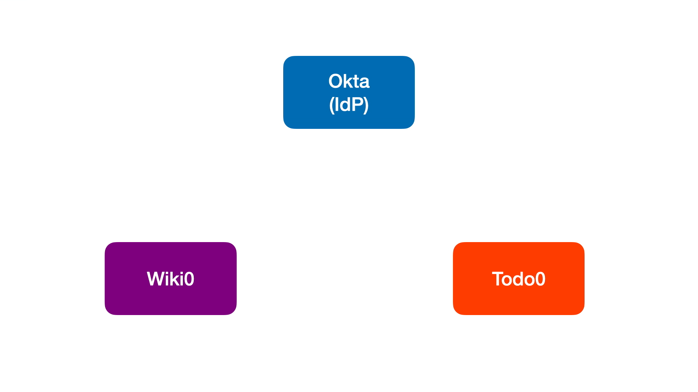
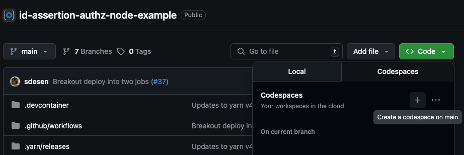
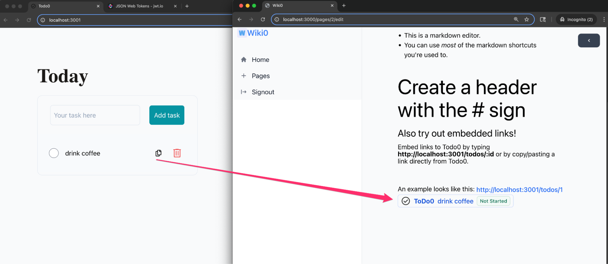

> ⚠️ **Important:**
> To run this Cross-App Access demo app, you'll need an Okta Preview account. If you don't already have one, or if you're interested in testing Cross-App Access with Okta as your Identity Provider (IdP), please [sign up for our early access offering](https://www.okta.com/saas-security/sign-up/?_gl=1*pp31c*_gcl_au*NjgzNDkyOTQxLjE3NTA4Nzg2Njk.*_ga*MTk5NjYyODgxMi4xNzUwMjg1MDM3*_ga_QKMSDV5369*czE3NTEyOTY4OTYkbzgkZzEkdDE3NTEyOTg0MjEkajM5JGwwJGgw).

# Identity Assertion Authorization Grant – Node Example

A proof-of-concept for the [Identity Assertion Authorization Grant](https://datatracker.ietf.org/doc/html/draft-parecki-oauth-identity-assertion-authz-grant) flow, demonstrating secure token exchange between SSO-enabled applications using Node.js. For a visual overview, see the [explainer video](https://www.youtube.com/watch?v=I0vdmg79Ga4).



# Table of Contents

- [Quickstart & Dev Setup](#quickstart--dev-setup)
- [Common Issues](#common-issues)
- [Troubleshooting](#troubleshooting)
- [Dev Tips](#dev-tips)
- [How to Integrate into an Existing Service](#how-to-integrate-into-an-existing-service)

# Quickstart & Dev Setup

**Highly Recommended:**

- **Run in GitHub Codespaces**

  - Click "Code" → "Create a codespace on main" in the GitHub UI and your environment will be ready in minutes.
  - Or, launch instantly:

    [](https://github.com/codespaces/new?repo=oktadev/id-assertion-authz-node-example)

  

**Alternative (Local Dev):**

- [Docker Desktop](https://www.docker.com/products/docker-desktop/) (required for local containers)
- [VS Code](https://code.visualstudio.com/) (required for Dev Containers)
- [Dev Containers VSCode Extension](https://marketplace.visualstudio.com/items?itemName=ms-vscode-remote.remote-containers)

## 1. Clone and Open in VS Code

> **Note:** If you are using GitHub Codespaces, you can skip this step as the repository will be automatically cloned for you.

```sh
git clone https://github.com/oktadev/id-assertion-authz-node-example.git
cd id-assertion-authz-node-example
```

- Open VS Code Command Palette and run "Dev Containers: Open Folder in Container". To open Command Palette, select **View** → **Command Palette...**, MacOS keyboard shortcut `Cmd+Shift+P`, or Windows keyboard shortcut `Ctrl+Shift+P`.

## 2. Configure Environment

```sh
yarn setup:env
```

> **Note:** The `yarn setup:env` command copies template `.env.default` files to `.env` so you can fill in your credentials.

Edit the following files to fill in required values:

- `packages/authorization-server/.env.todo`
- `packages/authorization-server/.env.wiki`
- `packages/mcp-bedrock-client/.env` <!-- Added line -->

**Required fields:**

| File                                      | Variable Name             | Values                                |
| ----------------------------------------- | ------------------------- | ------------------------------------- |
| `packages/authorization-server/.env.todo` | `CUSTOMER1_EMAIL_DOMAIN`  | `tables.fake`                         |
|                                           | `CUSTOMER1_AUTH_ISSUER`   | `https://{orgDomain}.oktapreview.com` |
|                                           | `CUSTOMER1_CLIENT_ID`     | `<OIDC client id at IdP>`             |
|                                           | `CUSTOMER1_CLIENT_SECRET` | `<OIDC client secret at IdP>`         |
| `packages/authorization-server/.env.wiki` | `CUSTOMER1_EMAIL_DOMAIN`  | `tables.fake`                         |
|                                           | `CUSTOMER1_AUTH_ISSUER`   | `https://{orgDomain}.oktapreview.com` |
|                                           | `CUSTOMER1_CLIENT_ID`     | `<OIDC client id at IdP>`             |
|                                           | `CUSTOMER1_CLIENT_SECRET` | `<OIDC client secret at IdP>`         |
| `packages/mcp-bedrock-client/.env`        | `AWS_ACCESS_KEY_ID`       | `<your AWS access key id>`            |
|                                           | `AWS_SECRET_ACCESS_KEY`   | `<your AWS secret access key>`        |

> **How to retrieve these values:**
>
> - These values are provided by your Identity Provider (IdP) when you register your OIDC application.
> - For AWS credentials, visit your AWS IAM console and create or retrieve an access key for your user.
> - Typically, you can find IdP values in your IdP's admin console or developer portal under the application/client settings.
> - For example, in Okta, Azure AD, Auth0, or similar providers, look for the "Issuer URL" and "Client ID" fields.
> - If unsure, consult your IdP or AWS documentation or administrator for guidance.

## 3. Install Dependencies & Seed the Database

```sh
yarn bootstrap
```

> **Note:**
> The `yarn bootstrap` command will also run `yarn resetdb` to initialize your databases. During this process, you’ll see a prompt:
>
> `Are you sure you want to reset your database? All data will be lost.`
>
> This prompt appears for each application (both wiki and todo) to make sure you really want to erase all existing data and start fresh.
>
> - Type `y` and press Enter at each prompt to confirm you want to reset and re-seed the databases for both apps.
> - This is required the first time you run the project, or whenever you want to start with clean test data in both the wiki and todo apps.

## 4. Start All Services

You can start all backend and frontend services in parallel using one of the following commands:

```sh
yarn dev:all
```

> **`yarn dev:all`** This command launches all backend and frontend services in parallel, each on its own port, so you can develop and test the full system at once.
>
> - If you prefer, you can manually open 4 terminals and run the following commands individually for more control:
>   - `yarn dev:wiki`
>   - `yarn auth:wiki`
>   - `yarn dev:todo`
>   - `yarn auth:todo`

Or, to start the MCP Bedrock Client instead of Wiki0:

```sh
yarn dev:mcp
```

> **`yarn dev:mcp`** replaces the Wiki0 client app with the MCP Bedrock Client.
> Use this if you want to run the MCP client app that interacts with the Todo MCP server.
>
> **Note:**
>
> - This command launches all backend and frontend services in parallel, each on its own port, so you can develop and test the full system at once.
> - If you prefer, you can manually open 4 terminals and run the following commands individually for more control:
>   - `yarn auth:wiki`
>   - `yarn dev:todo`
>   - `yarn auth:todo`
>   - `yarn dev:mcp-bedrock-client`

## Optionally, open the application UIs in your browser

Open a new terminal window or tab before running this command

```sh
yarn open:apps # Opens both todo0 and wiki0 application UIs in your browser.
```

> **Note:**
>
> - If you are running inside a dev container or remote environment, the browser may not open automatically.
> - In that case, please open the following URLs manually in your browser:
>   - [http://localhost:3000/](http://localhost:3000/) (MCP Client / Wiki0)
>   - [http://localhost:3001/](http://localhost:3001/) (Todo0)

## 5. Verify Your Setup

After starting all services, you can verify that your environment is working as expected by following these steps:

1. Open both application UIs (todo0 and wiki0) in your browser. You can use `yarn open:apps` or manually visit the URLs shown in the terminal output.
2. Log in to both applications using the test credentials provided (for example, email: `bob@tables.fake`)
3. Perform a basic operation in each app (e.g., create a todo item in todo0, create or edit a wiki page in wiki0).
4. Confirm that the operation succeeds and the UI updates as expected.



### What to do if a test fails

- If an operation does not work as expected (e.g., you cannot log in, create, or edit items), check the terminal output for errors.
- Common issues include misconfigured `.env` files, missing database migrations, or services not running.
- Review the "Common Issues" and "Troubleshooting" sections above for guidance.

# Common Issues

- **App not starting?** Ensure all `.env` files are present and filled in.
- **Database errors?** Try `yarn resetdb` to re-seed the database.
- **Ports in use?** Make sure no other apps are running on ports `3000`, `3001`, `5000`, or `5001`.

# Troubleshooting

If you have any trouble, try re-authenticating to both applications by signing out and signing in again.

# Dev Tips

**Access the mysql database directly with the following:**

```
mariadb -u root --password=avocado -P 3306
```

**Run the following after making schema changes to a schema.prisma file**

Make sure to replace the content in `<>`.

```
export WIKI_DATABASE_URL=<DB_URL>
export TODO_DATABASE_URL=<DB_URL>
```
